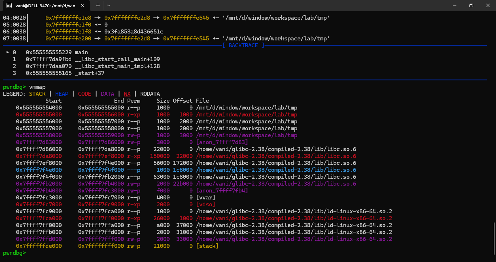

# Compiling

The standard glibc version on your system might be different with me. If it is, there will be differences in how the heap works. This doc shows you how to compile libc from source, and compile binaries to link against that, for further use (compiling, debugging, testing...). I write this based on this [ref](https://github.com/guyinatuxedo/Shogun/blob/main/compiling/compiling.md).

## Compiling Libc

The current version we are working with is `2.3x` (mostly `2.31`, `2.35`, `2.38` and `2.39`). There are some big changes between those versions, which effect a lot on exploits. This doc only guides you set up version `2.38`, you can do the same way for the others.

So, first off we need to download the glibc source code. You can find the mirrors at `https://www.gnu.org/software/libc/`. I recommend you download from the `/home/usr` folder (like me):

```
vani@DELL-3470:~$ pwd
/home/vani
```

Extract the glibc code, and create the build directory:

```
$   cd ~
$   tar -xf glibc-2.38.tar.bz2
$   cd glibc-2.38/
$   mkdir compiled-2.38
$   mkdir build
$   cd build/
```

Also, these are some things we need installed to compile glibc:

```
$   sudo apt-get install gcc make gawk bison
```

Then, from the `build` directory, we will go ahead and configure glibc for compiling:

```
$   ../configure --prefix=$HOME/glibc-2.38/compiled-2.38/
 . . .
```

Then, we will go ahead and compile glibc, this will take like 10 minutes:

```
$   make -j
 . . .
```

```
$   make install
 . . .
```

## Compile Binaries to Linking Against to new Libc

To compile binaries to link against the newly compiled libc version:

> Assume that you want to compile a C file `tmp.c` (in anywhere, since the libc stays in fixed path, just copy this command).

```
$   gcc -Xlinker -rpath=$HOME/glibc-2.38/compiled-2.38/lib/ -Xlinker -I$HOME/glibc-2.38/compiled-2.38/lib/ld-linux-x86-64.so.2 tmp.c -o tmp
```

Let's confirm that we are actually using the libc we compiled:

> Im using pwndbg.

```
$   gdb ./tmp
```

```
pwndbg> b *main
pwndbg> r
pwndbg> vmmap
```

It should shows something like this:

